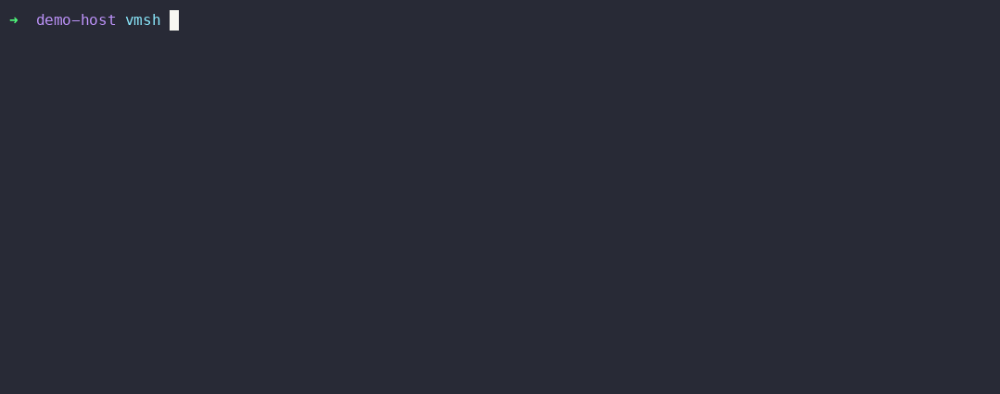

# vmsh

`vmsh` is an interactive shell for running host commands and VM-backed Linux
commands from one prompt. It is a product shell around the `ccvm` daemon: OCI
images become selectable command contexts, and `cc` remains the underlying VM
runtime, image importer, and debug command repository.

The repository is intended to be published as `github.com/tinyrange/vmsh`.

## What It Does

- Runs ordinary shell commands on the host by default.
- Switches to VM-backed command execution with `@<image>`.
- Keeps host and guest shell state warm when possible, so `cd`, aliases,
  functions, and exported variables survive across commands.
- Mounts the host root into guests at `/host` and mirrors the current host
  directory into the guest working directory.
- Supports named VMs, memory/CPU sizing, sudo/root execution, networking
  toggles, and architecture-specific image aliases.

## Demo



The demo is generated from real `vmsh` commands with a local VM and local demo
SSH server:

```sh
./tools/build.go demo
```

Example session:

```sh
@alpine
cat /etc/alpine-release

@work --from ubuntu:24.04 --memory 2g --cpus 4
python3 --version

@host git status
@alpine --no-network sh -lc 'uname -m && whoami'
@ --sudo apk add curl
```

## Requirements

- Go 1.25 or newer, matching `go.mod`.
- A checked-out `cc` submodule.
- A supported virtualization host when running VM commands:
  - `linux/amd64` with KVM and user access to `/dev/kvm`.
  - `windows/amd64` with Windows Hypervisor Platform enabled.
  - `darwin/arm64` with Hypervisor.framework.
  - `linux/arm64` with KVM.
- Network access when downloading kernels or pulling OCI images.

## Repository Layout

- `cmd/vmsh`: the `vmsh` shell.
- `cc`: git submodule containing `ccvm`, VM backends, image import, and the
  lower-level `cc` CLI.
- `tools/build.go`: local build and run helper for `cc`, `ccvm`, and `vmsh`.
  It builds guest init payloads, builds `ccvm` from the submodule, builds
  `vmsh`, signs `ccvm` on macOS, and can launch `vmsh -ccvm build/vmsh/ccvm`.
- `.github/workflows/release.yml`: tag-triggered single-binary releases for
  Linux, Windows, and signed macOS ARM64.

## Getting Started

Install the latest release to `~/.local/bin`:

```sh
curl -fsSL https://raw.githubusercontent.com/tinyrange/vmsh/main/install.sh | sh
```

The installer supports macOS ARM64 and Linux ARM64/AMD64 release binaries. To
install a specific release or choose another destination:

```sh
VMSH_VERSION=v0.1.0 VMSH_INSTALL_DIR=/usr/local/bin sh install.sh
```

Clone with submodules:

```sh
git clone --recurse-submodules https://github.com/tinyrange/vmsh.git
cd vmsh
```

If the repository was cloned without submodules:

```sh
git submodule update --init --recursive
```

Run the shell locally:

```sh
./tools/build.go run
```

On Windows, the same helper can be run with:

```powershell
go run .\tools\build.go run
```

Run an existing `ccvm` binary instead:

```sh
go build -o build/vmsh/vmsh ./cmd/vmsh
./build/vmsh/vmsh -ccvm /path/to/ccvm
```

Run a non-interactive script:

```sh
./tools/build.go
./build/vmsh/cc -ccvm ./build/vmsh/ccvm pull alpine ./cc/fixtures/alpine.simg

cat > /tmp/vmsh-smoke <<'EOF'
@smoke --from alpine --memory 256 --no-network sh -lc 'whoami; uname -m'
EOF

./build/vmsh/vmsh -ccvm ./build/vmsh/ccvm -script /tmp/vmsh-smoke
```

## Command Syntax

`vmsh` treats ordinary lines as commands in the current context. Lines beginning
with `@` are `vmsh` control lines:

```sh
@<oci-image> [vmsh-options] [--] [command...]
```

Common forms:

```sh
@alpine                         # select an image; VM starts lazily
@alpine uname -a                # run one command in alpine
@host pwd                       # run one command on the host
@work --from alpine --memory 4g # create or switch to a named VM system
@ --sudo whoami                 # run as root in the current VM
@alias ll=@host ls -la          # create an alias
@alias expand ll /tmp           # preview the expanded command
@jobs                           # list background jobs
@status                         # show selected context and VM status
@stop work                      # stop a named VM
```

Pipelines can mix host, VM, and SSH stages. `vmsh` follows normal POSIX shell
status semantics: the pipeline status is the final command's status. When an
earlier mixed-context stage exits non-zero, `vmsh` also prints a diagnostic that
names the stage number, context, exit status, and command so the final stage does
not hide the failure.

Copy endpoints use explicit context prefixes so accidental names fail early:

```sh
@copy @host:./file.txt @:~/file.txt          # host to current context
@copy @:~/file.txt @host:./file.txt          # current context to host
@copy @vm:work:/tmp/out @ssh:build:/tmp/out  # named VM to SSH host
@copy @image:alpine:/tmp/out @host:./out     # image context by name
```

`@copy` follows normal copy semantics across host, VM, isolated VM, and SSH
endpoints: files overwrite files, existing directory destinations receive the
source by name and merge with existing contents, and directory/non-directory
type conflicts fail instead of replacing the destination. Copy errors include
both source and destination endpoints. Interactive copies show lightweight
progress on the terminal; non-interactive copies stay quiet for scripts. Remote
to remote copies stream through a temporary host staging directory and remove it
when the transfer finishes or fails.

Supported options:

```sh
--from <source>
--cwd <guest-path>
--user <user>
--sudo
--memory <n|nM|nG>
--memory-mb <n>
--cpus <n>
--network
--no-network
--nested
--no-nested
--arch <amd64|arm64>
```

Use `--` when the guest command itself begins with an option:

```sh
@alpine -- --help
```

## Releases

Pushing a version tag matching `v*` runs the release workflow:

```sh
git tag v0.1.0
git push origin v0.1.0
```

The workflow builds one standalone `vmsh` binary per target:

- `linux/amd64`
- `linux/arm64`
- `windows/amd64`
- `darwin/arm64`

Release binaries are built with `embed_ccvm` and `embed_guestinit`. That compiles
the `ccvm` daemon entrypoint into the same Go executable as `vmsh` and embeds
the static Linux guest init payloads for amd64 and arm64 guests. At runtime,
`vmsh` re-execs itself with `VMSH_INTERNAL_CCVM=1` when it needs to start the
daemon, so release assets do not need a `ccvm` sidecar.

The release workflow also supports manual dry runs from GitHub Actions. Use
`workflow_dispatch`, provide a version string for artifact names, and leave
`publish` disabled to build, sign, notarize, upload artifacts, and generate
checksums without creating a GitHub Release.

The macOS binary is built on `macos-15` and codesigned with the Hypervisor
entitlement from `tools/entitlements.xml`. Configure these repository secrets
for Developer ID signing and notarization:

- `MACOS_CERTIFICATE`: base64-encoded `.p12` signing certificate.
- `MACOS_CERTIFICATE_PWD`: password for the `.p12` certificate.
- `MACOS_DEVELOPER_ID`: Developer ID Application identity. The workflow also
  accepts `DEVELOPER_ID` for compatibility with older `cc` release settings.
- `APPLE_ID`: Apple ID used by `notarytool`.
- `APPLE_ID_PASSWORD`: app-specific password for `notarytool`, or
  `@keychain:<profile>` to use a preconfigured notary keychain profile.
- `TEAM_ID`: Apple Developer Team ID.

The workflow signs the binary with hardened runtime, submits a temporary ZIP
containing that binary to Apple's notary service, and publishes the single
signed binary as the release asset.
