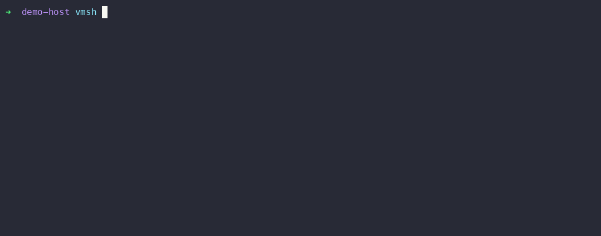

# vmsh

`vmsh` is an interactive shell for running commands across host, VM, and SSH
systems from one prompt. A normal shell keeps context as "the current working
directory." `vmsh` extends that idea: the current context is both the selected
system and that system's working directory. Ordinary command lines run in that
context, and `@` control lines change the selected system or ask `vmsh` to do
something directly.

`vmsh` is a product shell around the `ccvm` daemon: OCI images become selectable
VM systems, and `cc` remains the underlying VM runtime, image importer, and
debug command repository.

The repository is intended to be published as `github.com/tinyrange/vmsh`.

## What It Does

- Runs ordinary shell commands on the host by default.
- Tracks the selected system as part of shell context, alongside the working
  directory.
- Switches to VM-backed systems with `@<image>` and back to the host with
  `@host`.
- Keeps host and guest shell state warm when possible, so `cd`, aliases,
  functions, and exported variables survive across commands.
- Mounts the host root into guests at `/host` and mirrors the current host
  directory into the guest working directory.
- Supports named VMs, memory/CPU sizing, sudo/root execution, networking
  toggles, and architecture-specific image aliases.

## Demo



The demo is generated from real `vmsh` commands with a local VM and local demo
SSH server:

```sh
./tools/build.go demo
```

Example interactive session:

```sh
@alpine
cat /etc/alpine-release
cd /tmp
printf 'hello\n' > note.txt

@work --from ubuntu:24.04 --memory 2g --cpus 4
python3 --version

@host git status
@alpine --no-network
sh -lc 'uname -m && whoami'
@ --sudo apk add curl
```

## Requirements

- Go 1.25 or newer, matching `go.mod`.
- A checked-out `cc` submodule.
- A supported virtualization host when running VM commands:
  - `linux/amd64` with KVM and user access to `/dev/kvm`.
  - `windows/amd64` or `windows/arm64` with Windows Hypervisor Platform enabled.
  - `darwin/arm64` with Hypervisor.framework.
  - `linux/arm64` with KVM.
- Network access when downloading kernels or pulling OCI images.

## Repository Layout

- `cmd/vmsh`: the `vmsh` shell.
- `cc`: git submodule containing `ccvm`, VM backends, image import, and the
  lower-level `cc` CLI.
- `tools/build.go`: local build and run helper for `cc`, `ccvm`, and `vmsh`.
  It builds `ccvm` from the submodule as a sidecar artifact, builds `vmsh`,
  signs `ccvm` on macOS, and can launch the built `vmsh`.
- `.github/workflows/release.yml`: tag-triggered single-binary releases for
  Linux, Windows, and signed macOS ARM64.
- `docs/design`: accepted plans for cross-cutting vmsh features.

## Getting Started

Install the latest release to `~/.local/bin`:

```sh
curl -fsSL https://raw.githubusercontent.com/tinyrange/vmsh/main/install.sh | sh
```

The installer supports macOS ARM64, Linux ARM64/AMD64, and Windows ARM64/AMD64
release binaries. To install a specific release or choose another destination:

```sh
VMSH_VERSION=v0.1.0 VMSH_INSTALL_DIR=/usr/local/bin sh install.sh
```

Clone with submodules:

```sh
git clone --recurse-submodules https://github.com/tinyrange/vmsh.git
cd vmsh
```

If the repository was cloned without submodules:

```sh
git submodule update --init --recursive
```

Run the shell locally:

```sh
./tools/build.go run
```

`vmsh` expects an interactive terminal for normal use. Interactive sessions use
the native `vmsh` line editor, persistent history stored in the `ccvm` cache
directory, and autocomplete for `@` builtins, cached image names, options,
command names, and host paths.

By default, a `vmsh` frontend owns its daemon session and cleans it up when the
frontend exits. Start with `-system-session` or run `@detach` to keep the
session available after the current frontend closes.

On Windows, the same helper can be run with:

```powershell
go run .\tools\build.go run
```

Run an existing `ccvm` binary instead:

```sh
go build -o build/vmsh/vmsh ./cmd/vmsh
./build/vmsh/vmsh -ccvm /path/to/ccvm
```

Check the local build identity:

```sh
vmsh --version
```

Run a non-interactive script:

```sh
./tools/build.go
./build/vmsh/cc -ccvm ./build/vmsh/ccvm pull alpine ./cc/fixtures/alpine.simg

cat > /tmp/vmsh-smoke <<'EOF'
@smoke --from alpine --memory 256 --no-network sh -lc 'whoami; uname -m'
EOF

./build/vmsh/vmsh -ccvm ./build/vmsh/ccvm -script /tmp/vmsh-smoke
```

## Command Syntax

`vmsh` is a session shell. It treats ordinary lines as commands in the current
context: selected system plus working directory. Lines beginning with `@` are
`vmsh` control lines that switch system context, create named VM systems, run
builtins, or apply one-shot options:

```sh
@<oci-image> [vmsh-options] [--] [command...]
```

The primary workflow is selecting a system, then running ordinary commands in
that system:

```sh
@alpine
uname -a
cat /etc/alpine-release
cd /tmp
pwd
@host
git status
```

Appending a command to a context line is supported for one-shot use, but it is
not the main execution model:

```sh
@alpine uname -a
```

Common forms:

```sh
@alpine                         # select an image context; VM starts lazily
uname -a                        # run in the selected context
@alpine uname -a                # one-shot command in alpine
@host                           # switch back to the host context
@host pwd                       # one-shot host command
@work --from alpine --memory 4g # create or switch to a named VM system
@ --sudo whoami                 # run as root in the current VM
@alias ll=@host ls -la          # create an alias
@alias expand ll /tmp           # preview the expanded command
@jobs                           # list background jobs
@status                         # show selected context and VM status
@install                        # install/update the user-wide vmshd daemon copy
@version                        # show vmsh build metadata
@stop work                      # stop a named VM
```

Builtins:

```sh
@help
@host [command...]
@jobs
@sessions
@detach
@ps
@status
@version
@start
@stop [name|vm:name|ssh:name]
@forward <host-port:guest-port>
@copy SRC DST
@alias [name=value]
@alias expand line
```

`@host` with no command switches the current system to the host. `@host
<command>` runs a one-shot host command.

Pipelines can mix host, VM, and SSH stages. `vmsh` follows normal POSIX shell
status semantics: the pipeline status is the final command's status. When an
earlier mixed-context stage exits non-zero, `vmsh` also prints a diagnostic that
names the stage number, context, exit status, and command so the final stage does
not hide the failure.

Guest commands receive a TTY, terminal dimensions, and terminal color
environment. `vmsh` keeps command execution non-interactive and adds a small
color prelude for common commands such as `ls`. Interactive host and guest
commands run through persistent shell sessions when possible, so shell state can
survive across commands. Commands that need full foreground terminal control
fall back to a one-shot shell path.

Copy endpoints use explicit context prefixes so accidental names fail early:

```sh
@copy @host:./file.txt @:~/file.txt          # host to current context
@copy @:~/file.txt @host:./file.txt          # current context to host
@copy @vm:work:/tmp/out @ssh:build:/tmp/out  # named VM to SSH host
@copy @image:alpine:/tmp/out @host:./out     # image context by name
```

`@copy` follows normal copy semantics across host, VM, isolated VM, and SSH
endpoints: files overwrite files, existing directory destinations receive the
source by name and merge with existing contents, and directory/non-directory
type conflicts fail instead of replacing the destination. Copy errors include
both source and destination endpoints. Interactive copies show lightweight
progress on the terminal; non-interactive copies stay quiet for scripts. Remote
to remote copies stream through a temporary host staging directory and remove it
when the transfer finishes or fails.

Supported options:

```sh
--from <source>
--cwd <guest-path>
--user <user>
--sudo
--memory <n|nM|nG>
--memory-mb <n>
--cpus <n>
--network
--no-network
--nested
--no-nested
--arch <amd64|arm64>
```

Use `--` when the guest command itself begins with an option:

```sh
@alpine -- --help
```

Guest commands run as UID `1000` by default. Use `@ --sudo <cmd>` or
`@sudo <cmd>` to run a command as root in the current VM.

If the daemon reports nested virtualization support, `vmsh` enables it by
default for VM contexts. Use `@ --no-nested` to disable it for the current
context or a one-shot command.

Use `-record session.cast` to write asciinema v2 output. Use
`-record-raw session.raw.jsonl` to write a lossless JSONL event stream with
base64 terminal input/output bytes and resize events for rendering and
debugging investigations.

## Releases

Pushing a version tag matching `v*` runs the release workflow:

```sh
git tag v0.1.0
git push origin v0.1.0
```

The workflow builds one standalone `vmsh` binary per target:

- `linux/amd64`
- `linux/arm64`
- `windows/amd64`
- `windows/arm64`
- `darwin/arm64`

Release binaries always include the vmshd daemon entrypoint in the same Go
executable as `vmsh`. At runtime, `vmsh` re-execs itself with
`VMSH_INTERNAL_VMSHD=1` when it needs to start the authenticated local daemon.
Guest init helpers are built through the cc runtime cache path when a backend
needs them.

The release workflow also supports manual dry runs from GitHub Actions. Use
`workflow_dispatch`, provide a version string for artifact names, and leave
`publish` disabled to build, sign, notarize, upload artifacts, and generate
checksums without creating a GitHub Release.

The macOS binary is built on `macos-15` and codesigned with the Hypervisor
entitlement from `tools/entitlements.xml`. Configure these repository secrets
for Developer ID signing and notarization:

- `MACOS_CERTIFICATE`: base64-encoded `.p12` signing certificate.
- `MACOS_CERTIFICATE_PWD`: password for the `.p12` certificate.
- `MACOS_DEVELOPER_ID`: Developer ID Application identity. The workflow also
  accepts `DEVELOPER_ID` for compatibility with older `cc` release settings.
- `APPLE_ID`: Apple ID used by `notarytool`.
- `APPLE_ID_PASSWORD`: app-specific password for `notarytool`, or
  `@keychain:<profile>` to use a preconfigured notary keychain profile.
- `TEAM_ID`: Apple Developer Team ID.

The workflow signs the binary with hardened runtime, submits a temporary ZIP
containing that binary to Apple's notary service, and publishes the single
signed binary as the release asset.
